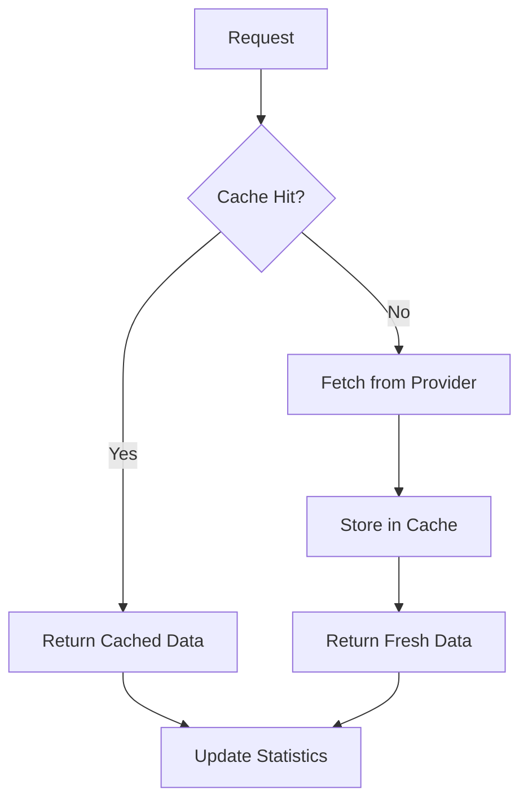

# 🔍 Search API - Privacy-Focused Search Aggregation Service

<div align="center">


**A comprehensive, privacy-focused search API that aggregates results from multiple privacy-respecting search engines**

[Features](#-key-features) •
[Installation](#-installation) •
[API Docs](#-api-reference) •
[Contributing](#-contributing)


```md
[](https://demo-worker.yoohoo.workers.dev)
</div>

---

## 📋 Table of Contents

- [Overview](#-overview)
- [Key Features](#-key-features)
- [System Architecture](#️-system-architecture)
- [Installation](#-installation)
- [Configuration](#️-configuration)
- [API Reference](#-api-reference)
- [Search Providers](#-search-providers)
- [Caching System](#-caching-system)
- [Rate Limiting](#️-rate-limiting)
- [Security Features](#-security-features)
- [Performance Optimization](#-performance-optimization)
- [Error Handling](#-error-handling)
- [Deployment](#-deployment)
- [Monitoring & Logging](#-monitoring--logging)
- [Development](#-development)
- [Demo](#-demo)
- [Testing](#-testing)
- [Contributing](#-contributing)
- [License](#-license)
- [Support](#️-support)

---

## 🌟 Overview

The **Search API** is a Node.js-based service built with Express.js that provides unified access to multiple privacy-respecting search engines and content providers. Unlike traditional search APIs, this service prioritizes user privacy, avoids tracking, and offers transparent data aggregation from ethical sources.

### Core Philosophy

> 🛡️ **Privacy-first approach** - No user tracking or profiling  
> 🔓 **Transparent data sourcing** - All sources clearly identified  
> ⚖️ **Ethical search aggregation** - Only privacy-respecting providers  
> 🌐 **Open source** - Community-driven development

<details>
<summary><b>📊 Quick Stats</b></summary>

| Metric | Value |
|--------|-------|
| Version | 3.2.0 |
| License | MIT |
| Min Node.js | 18.0.0 |
| Results per Query | 100+ |
| Supported Categories | Web, Images, Videos, News, Weather |

</details>

---

## 🚀 Key Features

### 🔍 Multi-Source Search Aggregation

- **Web Search** - Aggregates results from DuckDuckGo, StartPage, and other privacy-focused engines
- **Image Search** - Fetches images from multiple safe sources with metadata
- **Video Search** - Searches across privacy-respecting video platforms
- **News Search** - Aggregates news from independent and ethical news sources
- **Weather Data** - Fetches weather information without tracking

### ⚡ Performance & Reliability

| Feature | Description |
|---------|-------------|
| ⚡ **Intelligent Caching** | Multi-level caching with configurable TTL |
| 🔄 **Automatic Fallback** | If one provider fails, automatically uses alternatives |
| 🔁 **Request Retry** | Configurable retry logic with exponential backoff |
| 🔌 **Connection Pooling** | Optimized HTTP/HTTPS agents with keep-alive |

### 🔒 Privacy & Security

```text
✓ No Tracking - Zero user tracking or behavior profiling
✓ Safe Search - Configurable content filtering
✓ XSS Protection - Built-in sanitization for all inputs
✓ Security Headers - Helmet.js with custom CSP policies
✓ Rate Limiting - Protection against abuse and DDoS attacks
```

### 🛠️ Developer Experience

- ✅ **RESTful API** - Simple, consistent JSON API
- 📚 **Comprehensive Documentation** - Detailed API reference and examples
- 🔧 **Extensible Architecture** - Easy to add new search providers
- ⚙️ **Environment-Based Configuration** - Easy deployment across environments

---

## 🏗️ System Architecture

```text
┌─────────────────────────────────────────────────────────────┐
│                    Client Applications                       │
└──────────────────────────────┬──────────────────────────────┘
                               │
┌──────────────────────────────▼──────────────────────────────┐
│                     Search API Server                        │
│  ┌──────────────────────────────────────────────────────┐  │
│  │                 Express.js Server                     │  │
│  ├──────────────────────────────────────────────────────┤  │
│  │              Rate Limiting Middleware                 │  │
│  ├──────────────────────────────────────────────────────┤  │
│  │               Security Middleware                     │  │
│  ├──────────────────────────────────────────────────────┤  │
│  │              Request Routing Layer                    │  │
│  └──────────────────────────────────────────────────────┘  │
│                 │                    │                       │
│    ┌────────────▼──────┐  ┌─────────▼─────────┐            │
│    │   Cache Manager   │  │  Search Providers  │            │
│    │  • Memory Cache   │  │  • DuckDuckGo      │            │
│    │  • TTL Management │  │  • StartPage       │            │
│    │  • Cleanup Logic  │  │  • Image Sources   │            │
│    └───────────────────┘  │  • Video Platforms │            │
│                           │  • News Aggregators│            │
│                           └────────────────────┘            │
└──────────────────────────────┬──────────────────────────────┘
                               │
┌──────────────────────────────▼──────────────────────────────┐
│                 External Search Providers                    │
└─────────────────────────────────────────────────────────────┘
```

---

## 📦 Installation

### Prerequisites

<table>
<tr>
<td>

**Required**
- Node.js ≥ 18.0.0
- npm or yarn
- 512MB RAM minimum

</td>
<td>

**Recommended**
- 1GB RAM
- 100MB disk space
- Linux/Unix environment

</td>
</tr>
</table>

### Step-by-Step Installation

1. **Clone the repository**

```bash
git clone https://github.com/YooHoo-byte/search-api.git
cd search-api
```

2. **Install dependencies**

```bash
npm install
# or
yarn install
```

3. **Create environment configuration**

```bash
cp .env.example .env
# Edit .env with your configuration
```

4. **Start the server**

```bash
# Development mode with auto-restart
npm run dev

# Production mode
npm start
```

5. **Verify installation**

```bash
curl http://localhost:3000/api/status
```

**Expected response:**

```json
{
  "status": "online",
  "version": "3.2.0",
  "timestamp": "2025-12-24T10:30:00.000Z"
}
```

---

### 🐳 Docker Installation

<details>
<summary><b>Click to expand Docker setup</b></summary>

#### Build and run with Docker

```bash
# Build the Docker image
docker build -t search-api .

# Run the container
docker run -p 3000:3000 \
  -e PORT=3000 \
  -e NODE_ENV=production \
  --name search-api \
  search-api
```

#### Using Docker Compose

```yaml
# docker-compose.yml
version: '3.8'
services:
  search-api:
    build: .
    ports:
      - "3000:3000"
    environment:
      - PORT=3000
      - NODE_ENV=production
      - CORS_ORIGIN=*
    restart: unless-stopped
```

```bash
docker-compose up -d
```

</details>

---

## ⚙️ Configuration

### Environment Variables

Create a `.env` file in the root directory:

```bash
# ============================================
# Server Configuration
# ============================================
PORT=3000
NODE_ENV=production
HOST=0.0.0.0

# ============================================
# Security
# ============================================
CORS_ORIGIN=*
ALLOWED_DOMAINS=example.com,api.example.com
SESSION_SECRET=your-super-secret-key-here

# ============================================
# Rate Limiting
# ============================================
RATE_LIMIT_WINDOW_MS=900000  # 15 minutes
RATE_LIMIT_MAX_REQUESTS=100

# ============================================
# Cache Configuration
# ============================================
CACHE_TTL_SHORT=120000    # 2 minutes
CACHE_TTL_MEDIUM=600000   # 10 minutes
CACHE_TTL_LONG=3600000    # 60 minutes
MAX_CACHE_SIZE=10000

# ============================================
# Performance
# ============================================
REQUEST_TIMEOUT=20000
MAX_RETRIES=5
MAX_SOCKETS=100
MAX_FREE_SOCKETS=20

# ============================================
# Search Provider Configuration
# ============================================
ENABLE_DUCKDUCKGO=true
ENABLE_STARTPAGE=true
ENABLE_IMAGES=true
ENABLE_VIDEOS=true
ENABLE_NEWS=true
ENABLE_WEATHER=true

# ============================================
# Safe Search Default
# ============================================
DEFAULT_SAFE_SEARCH=moderate

# ============================================
# Logging
# ============================================
LOG_LEVEL=info
LOG_FORMAT=combined
ENABLE_ACCESS_LOGS=true
```

### Configuration Constants

```javascript
// Core configuration constants
const RESULTS_PER_PAGE = 100;
const MAX_FETCH_RESULTS = 500;
const REQUEST_TIMEOUT = 20000;
const MAX_RETRIES = 5;
const MAX_CACHE_SIZE = 10000;

// TTL configurations (in milliseconds)
const TTL = {
  short: 2 * 60 * 1000,    // 2 minutes - dynamic content
  medium: 10 * 60 * 1000,  // 10 minutes - search results
  long: 60 * 60 * 1000     // 60 minutes - static content
};

// Rate limiting configuration
const RATE_LIMIT = {
  windowMs: 15 * 60 * 1000, // 15 minutes
  max: 100 // limit each IP to 100 requests per windowMs
};
```

---

## 📚 API Reference

### Base URL

```text
http://localhost:3000/api
```

> 💡 All endpoints return JSON responses and support both `GET` and `POST` methods.

---

### Endpoints

#### 1️⃣ Search Endpoint

```http
GET /api/search?q={query}&page={page}&safe={level}&type={type}
POST /api/search
```

**Parameters:**

| Parameter | Type | Required | Default | Description |
|-----------|------|----------|---------|-------------|
| `q` | string | ✅ Yes | - | Search query |
| `page` | integer | ❌ No | 1 | Page number (1-5) |
| `safe` | string | ❌ No | moderate | Safe search level: `off`, `moderate`, `strict` |
| `type` | string | ❌ No | web | Result type: `web`, `images`, `videos`, `news`, `all` |
| `limit` | integer | ❌ No | 100 | Results per page (max 500) |

**Example Request:**

```bash
curl "http://localhost:3000/api/search?q=privacy+technology&page=1&safe=strict&type=web"
```

**Example Response:**

```json
{
  "query": "privacy technology",
  "page": 1,
  "total_pages": 5,
  "total_results": 500,
  "safe_search": "strict",
  "type": "web",
  "results": [
    {
      "title": "Privacy Technologies - Comprehensive Guide",
      "url": "https://example.com/privacy-tech",
      "description": "A complete guide to privacy-enhancing technologies...",
      "source": "DuckDuckGo",
      "domain": "example.com",
      "favicon": "https://example.com/favicon.ico",
      "position": 1,
      "timestamp": "2025-12-24T10:30:00.000Z"
    }
    // 99 more results...
  ],
  "metadata": {
    "processing_time": 245,
    "cache_status": "hit",
    "sources_used": ["DuckDuckGo", "StartPage"],
    "safe_search_applied": true
  }
}
```

---

#### 2️⃣ Image Search

```http
GET /api/images?q={query}&page={page}&safe={level}&size={size}
```

**Parameters:**

| Parameter | Type | Required | Default | Description |
|-----------|------|----------|---------|-------------|
| `q` | string | ✅ Yes | - | Search query |
| `page` | integer | ❌ No | 1 | Page number |
| `safe` | string | ❌ No | moderate | Safe search level |
| `size` | string | ❌ No | all | Image size: `small`, `medium`, `large`, `all` |
| `color` | string | ❌ No | all | Color filter: `color`, `bw`, `transparent` |
| `format` | string | ❌ No | all | Format: `jpg`, `png`, `gif`, `all` |

**Example Response:**

```json
{
  "query": "nature landscape",
  "page": 1,
  "results": [
    {
      "title": "Mountain Landscape",
      "url": "https://images.example.com/landscape1.jpg",
      "thumbnail": "https://images.example.com/thumb1.jpg",
      "source": "ImageProvider",
      "width": 1920,
      "height": 1080,
      "size": "large",
      "format": "jpg",
      "color": "color",
      "filesize": 1250000,
      "author": "Photographer Name",
      "license": "Creative Commons"
    }
    // 99 more image results...
  ]
}
```

---

#### 3️⃣ Video Search

```http
GET /api/videos?q={query}&page={page}&safe={level}&duration={duration}
```

**Parameters:**

| Parameter | Type | Required | Default | Description |
|-----------|------|----------|---------|-------------|
| `q` | string | ✅ Yes | - | Search query |
| `page` | integer | ❌ No | 1 | Page number |
| `safe` | string | ❌ No | moderate | Safe search level |
| `duration` | string | ❌ No | all | Duration: `short`, `medium`, `long`, `all` |
| `quality` | string | ❌ No | all | Quality: `hd`, `sd`, `all` |
| `platform` | string | ❌ No | all | Platform filter |

---

#### 4️⃣ News Search

```http
GET /api/news?q={query}&page={page}&category={category}&country={country}
```

**Parameters:**

| Parameter | Type | Required | Default | Description |
|-----------|------|----------|---------|-------------|
| `q` | string | ❌ No | - | Search query (optional for top news) |
| `page` | integer | ❌ No | 1 | Page number |
| `category` | string | ❌ No | general | Category: `general`, `technology`, `business`, `sports`, `entertainment`, `health`, `science` |
| `country` | string | ❌ No | us | Country code (ISO 3166-1 alpha-2) |
| `language` | string | ❌ No | en | Language code |

---

#### 5️⃣ Weather Information

```http
GET /api/weather?q={location}&units={units}
```

**Parameters:**

| Parameter | Type | Required | Default | Description |
|-----------|------|----------|---------|-------------|
| `q` | string | ✅ Yes | - | City name or coordinates (lat,lon) |
| `units` | string | ❌ No | metric | Units: `metric`, `imperial`, `standard` |
| `lang` | string | ❌ No | en | Language code |

---

#### 6️⃣ System Status

```http
GET /api/status
```

**Response:**

```json
{
  "status": "online",
  "version": "3.2.0",
  "timestamp": "2025-12-24T10:30:00.000Z",
  "uptime": 3600,
  "memory": {
    "used": 125.5,
    "total": 512,
    "percentage": 24.5
  },
  "cache": {
    "size": 1250,
    "hits": 12500,
    "misses": 2500,
    "hit_rate": "83.33%"
  },
  "requests": {
    "total": 15000,
    "last_hour": 500,
    "active_connections": 12
  }
}
```

---

#### 7️⃣ Cache Management

```http
GET /api/cache/stats
DELETE /api/cache/clear
```

---

### Response Format

#### Success Response

```json
{
  "success": true,
  "data": {
    // Endpoint-specific data
  },
  "metadata": {
    "processing_time": 150,
    "cache_status": "miss",
    "timestamp": "2025-12-24T10:30:00.000Z"
  }
}
```

#### Error Response

```json
{
  "success": false,
  "error": {
    "code": "VALIDATION_ERROR",
    "message": "Query parameter is required",
    "details": {
      "parameter": "q",
      "reason": "missing"
    }
  },
  "timestamp": "2025-12-24T10:30:00.000Z"
}
```

---

## 🔍 Search Providers

### Supported Providers

<table>
<tr>
<td width="50%">

#### 🌐 Web Search Providers

**DuckDuckGo**
- ✅ No tracking or personal data collection
- 🎯 Instant Answers feature
- 🚀 Bang commands support (!g, !w, !yt)

**StartPage**
- 🔍 Google results with privacy
- 👻 Anonymous View feature
- 🛡️ Enhanced privacy protection

**Marginalia**
- 📚 Focus on text-heavy sites
- 🎓 Academic and technical content
- 🚫 No commercial bias

</td>
<td width="50%">

#### 🖼️ Image Search Providers

**Unsplash API**
- 📸 Free high-quality images
- ⚖️ Creative Commons Zero license
- 🎨 Professional photography

**Pixabay API**
- 💰 Free for commercial use
- 📦 Large collection
- 🎯 Multiple formats

**Privacy-respecting aggregators**
- 🔐 Multiple source aggregation
- 🔒 Safe search filtering
- 📊 Metadata extraction

</td>
</tr>
</table>

<details>
<summary><b>📹 Video Search Providers</b></summary>

- **Invidious Instances** - YouTube front-end
  - No Google tracking
  - Multiple quality options
  - Privacy-focused

- **PeerTube Instances** - Federated video platform
  - Decentralized network
  - Free software
  - Community-operated

</details>

<details>
<summary><b>📰 News Providers</b></summary>

- **RSS Feed Aggregators**
  - Multiple news sources
  - Real-time updates
  - Category filtering

- **Independent News APIs**
  - Non-corporate sources
  - Regional coverage
  - Multiple languages

</details>

---

### Provider Configuration

```javascript
// Provider configuration example
const PROVIDERS = {
  duckduckgo: {
    enabled: process.env.ENABLE_DUCKDUCKGO === 'true',
    url: 'https://html.duckduckgo.com/html/',
    params: {
      q: '{query}',
      s: '{start}',
      dc: '{safe_search}',
      kl: '{region}'
    },
    parser: 'duckduckgoParser',
    weight: 1.0,
    fallback: true
  },
  // Additional providers...
};
```

---

### Adding New Providers

> 📝 **Note:** Follow these steps to add a new search provider

**Step 1:** Create provider function in `src/providers/`

```javascript
export async function searchViaNewProvider(query, options = {}) {
  const { page = 1, safeSearch = 'moderate' } = options;
  
  try {
    // Implementation logic
    const results = await fetchResults(query, page, safeSearch);
    
    // Format results consistently
    return results.map(result => ({
      title: result.title,
      url: result.link,
      description: result.snippet,
      source: 'NewProvider',
      domain: extractDomain(result.link),
      position: result.position,
      timestamp: new Date().toISOString()
    }));
  } catch (error) {
    console.error(`NewProvider search error:`, error.message);
    return []; // Return empty array on failure
  }
}
```

**Step 2:** Register provider in the main search function

```javascript
const providers = [
  { name: 'newprovider', func: searchViaNewProvider, weight: 0.8 }
];
```

**Step 3:** Add provider-specific parsing logic if needed

---

## 💾 Caching System

### Cache Architecture

The API implements a **multi-layer caching system**:



**Key Features:**

- 🚀 **Memory Cache** - In-memory Map for fastest access
- ⏰ **TTL Management** - Automatic expiration based on content type
- 📦 **Size Management** - Automatic cleanup when limits reached
- 📊 **Statistics** - Comprehensive cache performance tracking

---

### Cache Configuration

```javascript
// Default TTL values
const TTL = {
  short: 2 * 60 * 1000,    // 2 minutes for dynamic content
  medium: 10 * 60 * 1000,  // 10 minutes for search results
  long: 60 * 60 * 1000     // 60 minutes for static content
};

const MAX_CACHE_SIZE = 10000; // Maximum cache entries
```

---

### Cache Functions

```javascript
// Get data from cache
const cachedData = cacheGet('search:privacy:1:moderate');

// Set data in cache
cacheSet('search:privacy:1:moderate', results, TTL.medium);

// Clear entire cache
cacheClear();

// Get cache statistics
const stats = getCacheStats();
```

---

### Cache Key Strategy

Cache keys follow a structured format:

```text
{type}:{query}:{page}:{safe}:{options}
```

**Examples:**

- `search:privacy technology:1:moderate:web`
- `images:nature:2:strict:large`
- `news:technology::us:en`

---

### Cache Performance Monitoring

```json
{
  "size": 1250,
  "hits": 12500,
  "misses": 2500,
  "hit_rate": "83.33%",
  "max_size": 10000,
  "expired_entries": 42
}
```

---

## 🛡️ Rate Limiting

### Configuration

```javascript
const RATE_LIMIT = {
  windowMs: 15 * 60 * 1000, // 15 minutes
  max: 100 // 100 requests per IP per window
};
```

### Implementation Details

| Feature | Description |
|---------|-------------|
| 📊 **Algorithm** | Sliding window for fair rate limiting |
| 🔧 **Dev Mode** | Exemption for easier testing |
| 📡 **Headers** | `X-RateLimit-Limit`, `X-RateLimit-Remaining`, `X-RateLimit-Reset` |

---

### Rate Limit Response

When limit is exceeded:

```json
{
  "error": "Rate limit exceeded",
  "message": "Too many requests, please try again in 125 seconds",
  "retry_after": 125
}
```

---

### Customizing Rate Limits

```javascript
// Specific endpoint rate limiting
app.use('/api/search', rateLimiter({ windowMs: 60000, max: 30 }));
app.use('/api/images', rateLimiter({ windowMs: 60000, max: 50 }));
```

---

## 🔒 Security Features

### 1. Helmet.js Security Headers

> 🛡️ Comprehensive security header management

- ✅ **Content Security Policy** - Restricts resource loading
- ✅ **XSS Protection** - Browser XSS filter activation
- ✅ **Frame Options** - Clickjacking protection
- ✅ **HSTS Enforcement** - HTTPS enforcement

---

### 2. Input Validation & Sanitization

```javascript
function validateQuery(query) {
  // Length validation
  if (query.length > 500) {
    throw new Error('Query too long');
  }
  
  // XSS pattern detection
  const xssPatterns = [
    /<script\b[^<]*(?:(?!<\/script>)<[^<]*)*<\/script>/gi,
    /javascript:/gi,
    /on\w+\s*=/gi
  ];
  
  // Content sanitization
  return sanitizeHTML(query.trim());
}
```

---

### 3. Safe Search Implementation

| Level | Description |
|-------|-------------|
| 🔴 **Off** | No filtering |
| 🟡 **Moderate** | Default filtering (recommended) |
| 🟢 **Strict** | Maximum filtering |

---

### 4. CORS Configuration

```javascript
const corsOptions = {
  origin: process.env.CORS_ORIGIN || "*",
  methods: ['GET', 'POST'],
  allowedHeaders: ['Content-Type', 'Authorization'],
  credentials: true,
  maxAge: 86400 // 24 hours
};
```

---

### 5. HTTP Agent Security

```javascript
const httpsAgent = new https.Agent({
  keepAlive: true,
  maxSockets: 100,
  rejectUnauthorized: process.env.NODE_ENV === 'production'
});
```

---

## ⚡ Performance Optimization

### 1. Connection Pooling

- ✅ Keep-alive connections
- ✅ Socket reuse
- ✅ Connection limit management

---

### 2. Parallel Request Processing

```javascript
async function fetchAllProviders(query, options) {
  const promises = providers.map(provider =>
    provider.func(query, options).catch(error => {
      console.error(`${provider.name} failed:`, error.message);
      return [];
    })
  );
  
  const results = await Promise.allSettled(promises);
  return mergeResults(results);
}
```

---

### 3. Result Deduplication

```javascript
function deduplicateResults(results) {
  const seen = new Set();
  return results.filter(result => {
    const key = `${result.url}|${result.title}`;
    if (seen.has(key)) return false;
    seen.add(key);
    return true;
  });
}
```

---

### 4. Pagination Optimization

- 📄 Lazy loading
- 🔄 Cursor-based pagination
- 🚀 Prefetching strategy

---

### 5. Memory Management

- 📦 Cache size limits
- 🧹 Automatic cleanup
- 🔍 Memory leak prevention

---

## 🚨 Error Handling

### Error Response Structure

```json
{
  "success": false,
  "error": {
    "code": "PROVIDER_UNAVAILABLE",
    "message": "Search provider is temporarily unavailable",
    "details": {
      "provider": "DuckDuckGo",
      "retry_in": 30
    }
  }
}
```

---

### Error Types

| Error Type | Description |
|------------|-------------|
| ⚠️ **Validation Errors** | Invalid input parameters |
| 🔌 **Provider Errors** | External service failures |
| 📛 **Rate Limit Errors** | Too many requests |
| ❌ **Internal Errors** | Server-side issues |
| 🌐 **Network Errors** | Connectivity problems |

---

### Fallback Strategy

```javascript
try {
  results = await primaryProvider(query, options);
} catch (primaryError) {
  console.warn('Primary provider failed, trying fallback...');
  
  try {
    results = await fallbackProvider(query, options);
    results.metadata.fallback_used = true;
  } catch (fallbackError) {
    throw new AggregateError(
      [primaryError, fallbackError],
      'All search providers failed'
    );
  }
}
```

---

### Retry Logic

```javascript
async function fetchWithRetry(url, options = {}, maxRetries = 5) {
  for (let attempt = 0; attempt < maxRetries; attempt++) {
    try {
      return await fetch(url, options);
    } catch (error) {
      if (attempt === maxRetries - 1) throw error;
      
      const waitTime = 1000 * Math.pow(2, attempt);
      await delay(waitTime);
    }
  }
}
```

---

## 🚀 Deployment

### Environment-Specific Configurations

#### Development

```bash
NODE_ENV=development
PORT=3000
CORS_ORIGIN=http://localhost:3000
LOG_LEVEL=debug
```

#### Production

```bash
NODE_ENV=production
PORT=80
CORS_ORIGIN=https://yourdomain.com
LOG_LEVEL=info
ENABLE_CLUSTER=true
WORKERS=4
```

---

### Deployment Platforms

<details>
<summary><b>1️⃣ Traditional Server</b></summary>

```bash
# Install PM2 process manager
npm install -g pm2

# Start application
pm2 start src/index.js --name "search-api"

# Save process list
pm2 save

# Setup startup script
pm2 startup

# Monitor application
pm2 monit
```

</details>

<details>
<summary><b>2️⃣ Docker Deployment</b></summary>

```dockerfile
FROM node:18-alpine

WORKDIR /app

COPY package*.json ./
RUN npm ci --only=production

COPY . .

USER node

EXPOSE 3000

CMD ["node", "src/index.js"]
```

</details>

<details>
<summary><b>3️⃣ Kubernetes Deployment</b></summary>

```yaml
apiVersion: apps/v1
kind: Deployment
metadata:
  name: search-api
spec:
  replicas: 3
  selector:
    matchLabels:
      app: search-api
  template:
    metadata:
      labels:
        app: search-api
    spec:
      containers:
      - name: search-api
        image: search-api:3.2.0
        ports:
        - containerPort: 3000
        env:
        - name: NODE_ENV
          value: production
        resources:
          requests:
            memory: "256Mi"
            cpu: "250m"
          limits:
            memory: "512Mi"
            cpu: "500m"
```

</details>

<details>
<summary><b>4️⃣ Serverless Deployment (AWS Lambda)</b></summary>

```yaml
# serverless.yml
service: search-api

provider:
  name: aws
  runtime: nodejs18.x
  stage: production
  region: us-east-1

functions:
  api:
    handler: src/index.handler
    events:
      - httpApi: '*'
    environment:
      NODE_ENV: production
```

</details>

---
---
### 🚀 Demo

The Search API is deployed as a **Cloudflare Worker** and returns raw JSON responses.

### 🌍 Live Demo Endpoint
🔗 **https://demo-worker.yoohoo.workers.dev**

### 🔎 Example Request
```bash
curl "https://demo-worker.yoohoo.workers.dev/search?q=privacy"

📦 Example Response (truncated)

{
  "query": "privacy",
  "totalResults": 300,
  "results": [
    {
      "title": "Privacy Tools",
      "url": "https://example.com",
      "source": "DuckDuckGo"
    }
  ]
}

    ℹ️ The live endpoint returns 300+ lines of JSON.
    The response above is intentionally truncated for readability.


---

```md
### 🌐 Browser Test
Open directly in your browser:

https://demo-worker.yoohoo.workers.dev/search?q=linux | jq
https://demo-worker.yoohoo.workers.dev/images?q=linux | jq
https://demo-worker.yoohoo.workers.dev/videos?q=linux | jq
https://demo-worker.yoohoo.workers.dev/github?q=linux | jq
https://demo-worker.yoohoo.workers.dev/news?q=linux | jq
https://demo-worker.yoohoo.workers.dev/weather?q=linux | jq

https://demo-worker.yoohoo.workers.dev/all?q=linux | jq

https://demo-worker.yoohoo.workers.dev/massive?q=linux | jq


```bash
curl "https://demo-worker.yoohoo.workers.dev/search?q=linux" | jq


```bash
# Increase Node.js memory limit
NODE_OPTIONS="--max-old-space-size=1024"

# Configure garbage collection
NODE_OPTIONS="--max-old-space-size=1024 --gc-interval=100"
```

#### Load Balancing

```nginx
# Nginx configuration
upstream search_api {
  least_conn;
  server 127.0.0.1:3001;
  server 127.0.0.1:3002;
  server 127.0.0.1:3003;
  keepalive 32;
}

server {
  listen 80;
  server_name api.example.com;
  
  location / {
    proxy_pass http://search_api;
    proxy_http_version 1.1;
    proxy_set_header Connection "";
  }
}
```

---

## 📊 Monitoring & Logging

### Logging Configuration

```javascript
// Winston logger configuration
const logger = winston.createLogger({
  level: process.env.LOG_LEVEL || 'info',
  format: winston.format.combine(
    winston.format.timestamp(),
    winston.format.json()
  ),
  transports: [
    new winston.transports.File({ filename: 'error.log', level: 'error' }),
    new winston.transports.File({ filename: 'combined.log' }),
    new winston.transports.Console({
      format: winston.format.simple()
    })
  ]
});
```

---

### Monitoring Endpoints

#### Health Check

```http
GET /health
```

**Response:**

```json
{
  "status": "healthy",
  "timestamp": "2025-12-24T10:30:00.000Z",
  "services": {
    "cache": "healthy",
    "providers": {
      "duckduckgo": "healthy",
      "startpage": "healthy"
    }
  }
}
```

---

#### Metrics Endpoint

```http
GET /metrics
```

**Prometheus-compatible metrics:**

```text
# HELP http_requests_total Total HTTP requests
# TYPE http_requests_total counter
http_requests_total{method="GET",path="/api/search",status="200"} 1250

# HELP cache_hits_total Total cache hits
# TYPE cache_hits_total counter
cache_hits_total 12500
```

---

### Performance Metrics

- 📈 **Response Times** - P50, P95, P99 percentiles
- 💾 **Cache Hit Rates** - Overall and per-endpoint
- 🔌 **Provider Latency** - Each provider's performance
- ⚠️ **Error Rates** - Per-endpoint error percentages
- 💻 **Resource Usage** - CPU, memory, network

---

### Alerting Configuration

```yaml
# Alert rules
alerting:
  rules:
    - alert: HighErrorRate
      expr: rate(http_requests_total{status=~"5.."}[5m]) > 0.05
      for: 5m
      labels:
        severity: critical
      annotations:
        summary: "High error rate detected"
        
    - alert: CachePerformanceDegraded
      expr: cache_hit_rate < 0.7
      for: 10m
      labels:
        severity: warning
```

---

## 💻 Development

### Development Setup

1. **Clone and install**

```bash
git clone https://github.com/YooHoo-byte/search-api.git
cd search-api
npm install
```

2. **Development server with hot reload**

```bash
npm run dev
```

3. **Run tests**

```bash
npm test              # Run all tests
npm run test:unit     # Unit tests only
npm run test:integration  # Integration tests
npm run test:coverage # Test coverage report
```

---

### Project Structure

```text
search-api/
├── 📁 src/
│   └── 📄 index.js              # Main application file
│    
├── 📄 package.json           # Dependencies
├── 📄 Dockerfile            # Docker configuration
└── 📄 README.md             # This file
```

---

### Adding New Features

#### 1. New Search Type

```javascript
// 1. Create provider function
export async function searchViaNewType(query, options) {
  // Implementation
}

// 2. Add route
app.get('/api/newtype', async (req, res) => {
  const results = await searchViaNewType(req.query.q, req.query);
  res.json(results);
});

// 3. Update documentation
```

#### 2. New Provider

```javascript
// 1. Implement provider logic
// 2. Add to provider registry
// 3. Configure environment variables
// 4. Add provider-specific tests
```

---

### Code Style Guidelines

- ✅ **ES6+ Features** - Use modern JavaScript features
- ✅ **Async/Await** - Prefer async/await over callbacks
- ✅ **Error Handling** - Comprehensive try-catch blocks
- ✅ **Documentation** - JSDoc comments for all functions

---

### Mocking External Services

```javascript
// Mock fetch responses
global.fetch = jest.fn(() =>
  Promise.resolve({
    ok: true,
    status: 200,
    json: () => Promise.resolve(mockSearchResults),
    text: () => Promise.resolve(mockHTML)
  })
);

// Test with mocked provider
test('search returns formatted results', async () => {
  const results = await searchViaDuckDuckGo('test query');
  expect(results).toHaveLength(100);
  expect(results[0]).toHaveProperty('title');
  expect(results[0]).toHaveProperty('url');
});
```

---

## 🤝 Contributing

We welcome contributions! Please follow these guidelines:

### Contribution Process

1. 🍴 **Fork the repository**

2. **Create a feature branch**
   ```bash
   git checkout -b feature/amazing-feature
   ```

3. **Commit your changes**
   ```bash
   git commit -m 'Add amazing feature'
   ```

4. **Push to the branch**
   ```bash
   git push origin feature/amazing-feature
   ```

5. 🔀 **Open a Pull Request**

---

### Development Guidelines

- ✅ **Code Style** - Follow existing code patterns
- ✅ **Testing** - Add tests for new features
- ✅ **Documentation** - Update relevant documentation
- ✅ **Commit Messages** - Use conventional commits
- ✅ **Pull Requests** - Reference related issues

---

### Adding New Providers

> ⚠️ **Important:** Ensure the provider respects user privacy

**Checklist:**

- [ ] Check Privacy Policy
- [ ] Implement Interface
- [ ] Add Configuration
- [ ] Write Tests
- [ ] Update Documentation

---

### Reporting Issues

When reporting issues:

- ✅ **Check Existing Issues** - Avoid duplicates
- ✅ **Provide Details** - Include steps to reproduce
- ✅ **Environment Info** - Node.js version, OS, etc.
- ✅ **Expected vs Actual** - Clear description of the problem
- ✅ **Code Examples** - If applicable, provide code snippets

---

## 📄 License

This project is licensed under the **MIT License** - see the [LICENSE](LICENSE) file for details.

### MIT License Summary

```text
Permission is hereby granted, free of charge, to any person obtaining a copy
of this software and associated documentation files (the "Software"), to deal
in the Software without restriction, including without limitation the rights
to use, copy, modify, merge, publish, distribute, sublicense, and/or sell
copies of the Software, and to permit persons to whom the Software is
furnished to do so, subject to the following conditions:

The above copyright notice and this permission notice shall be included in all
copies or substantial portions of the Software.

THE SOFTWARE IS PROVIDED "AS IS", WITHOUT WARRANTY OF ANY KIND, EXPRESS OR
IMPLIED, INCLUDING BUT NOT LIMITED TO THE WARRANTIES OF MERCHANTABILITY,
FITNESS FOR A PARTICULAR PURPOSE AND NONINFRINGEMENT.
```

---

### Attribution

If you use this software, please consider:

- ⭐ **Giving credit to the original author**
- 🔗 **Linking back to this repository**
- 🤝 **Sharing improvements with the community**

---

## ❤️ Support

### Getting Help

| Resource | Description |
|----------|-------------|
| 📚 **Documentation** | This README and code comments |
| 🐛 **Issues** | [GitHub Issues](https://github.com/YooHoo-byte/search-api/issues) for bug reports |
| 💬 **Discussions** | [GitHub Discussions](https://github.com/YooHoo-byte/search-api/discussions) for questions |
| 👥 **Community** | Privacy-focused developer communities |

---

### Commercial Support

For commercial support, enterprise features, or custom development:

- 💼 **Consulting** - Custom implementations and integrations
- 🎓 **Training** - Team training and workshops
- ☁️ **Hosting** - Managed hosting solutions
- 🔧 **Customization** - Tailored features for specific needs

---

### Sponsorship

If you find this project useful, consider:

- 💖 **GitHub Sponsors** - Support ongoing development
- 💻 **Code Contributions** - Help improve the project
- 📝 **Documentation** - Help improve documentation
- 🤝 **Community Help** - Assist other users

---

### Acknowledgments

- 🙏 Thanks to all privacy-focused search providers
- 💻 Open source community for tools and libraries
- 👥 Contributors who help improve the project
- 📢 Users who provide feedback and suggestions

---

## 📞 Contact

<div align="center">

**Project Maintainer:** YooHoo-byte

[](https://github.com/YooHoo-byte/search-api)
[](https://github.com/YooHoo-byte/search-api/issues)
[](https://github.com/YooHoo-byte/search-api/wiki)

---

**Last Updated:** December 24, 2025 | **Version:** 3.2.0

Made with privacy in mind by YooHoo

---

⭐ **Star this repository if you find it helpful!** ⭐

</div>
